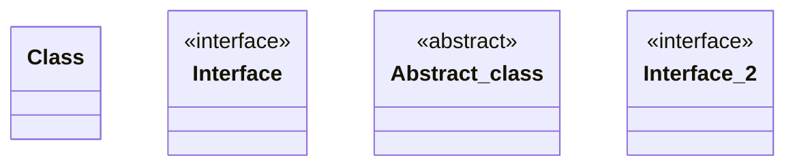

# class_diagramssssssss

```mermaid
classDiagram
  class Class
  class Interface {
    <<interface>>
  }
  class Abstract_class {
    <<abstract>>
  }
  class Interface_2 {
    <<interface>>
  }
%% mermade:{"v":1,"diagramType":"class","nodes":{"Class":{"x":570.57421875,"y":247.7890625,"w":220,"h":70,"kind":"class","members":[]},"Interface":{"x":584.2734375,"y":446.1328125,"w":220,"h":70,"kind":"interface","members":[],"stereotype":"interface"},"Abstract_class":{"x":1028.88671875,"y":319.77734375,"w":220,"h":70,"kind":"abstract","members":[],"stereotype":"abstract"},"Interface_2":{"x":845.7181919642857,"y":155.18080357142856,"w":220,"h":70,"kind":"interface","members":[],"stereotype":"interface"}},"groups":{},"edges":{}}
```
