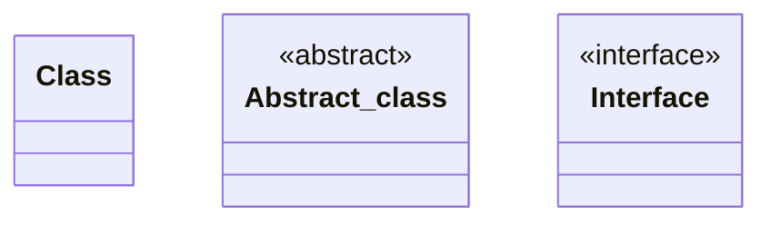

# sssssssddddd

```mermaid
classDiagram
  class Class
  class Abstract_class {
    <<abstract>>
  }
  class Interface {
    <<interface>>
  }
%% mermade:{"v":1,"diagramType":"class","nodes":{"Class":{"x":428.65234375,"y":427.6484375,"w":220,"h":70,"kind":"class","members":[]},"Abstract_class":{"x":881.65625,"y":386.50390625,"w":220,"h":70,"kind":"abstract","members":[],"stereotype":"abstract"},"Interface":{"x":672.453125,"y":219.84765625,"w":220,"h":70,"kind":"interface","members":[],"stereotype":"interface"}},"groups":{},"edges":{}}
```
