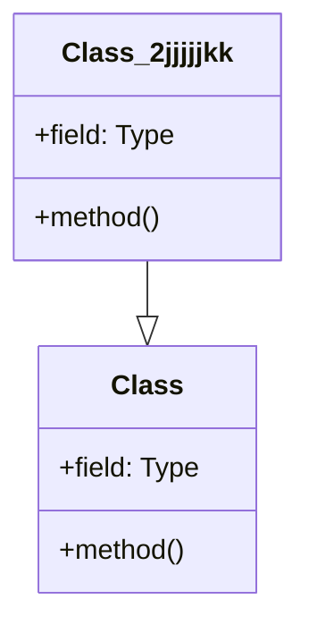

# design

```mermaid
classDiagram
  class Class {
    +field: Type
    +method()
  }
  class Class_2jjjjjkk {
    +field: Type
    +method()
  }
  Class_2jjjjjkk --|> Class
%% mermade:{"v":1,"diagramType":"class","nodes":{"Class":{"x":384.95703125,"y":207.69140625,"w":220,"h":88,"kind":"class","members":["+field: Type","+method()"]},"Class_2jjjjjkk":{"x":862.49609375,"y":203.828125,"w":220,"h":88,"kind":"class","members":["+field: Type","+method()"]}},"groups":{},"edges":{"e1":{"relation":"extends","label":""}}}
```
