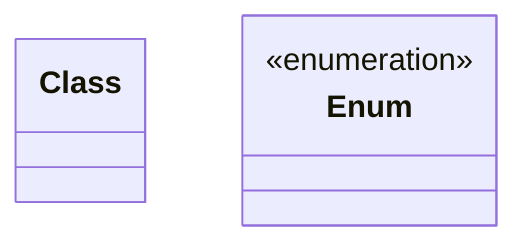

# draw

```mermaid
classDiagram
  class Class
  class Enum {
    <<enumeration>>
  }
%% mermade:{"v":1,"diagramType":"class","nodes":{"Class":{"x":408.796875,"y":329.58203125,"w":220,"h":70,"kind":"class","members":[]},"Enum":{"x":990.45703125,"y":181.078125,"w":200,"h":70,"kind":"enum","members":[],"stereotype":"enumeration"}},"groups":{},"edges":{}}
```
