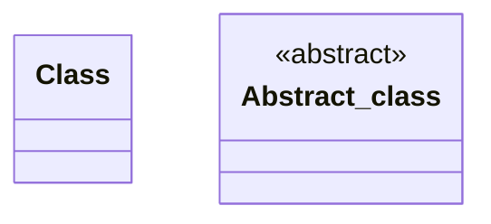

# lld diagrm

```mermaid
classDiagram
  class Class
  class Abstract_class {
    <<abstract>>
  }
%% mermade:{"v":1,"diagramType":"class","nodes":{"Class":{"x":231.90319005544063,"y":22.945211273271326,"w":220,"h":70,"kind":"class","members":[]},"Abstract_class":{"x":592.3067497970831,"y":-38.155865180283364,"w":220,"h":70,"kind":"abstract","members":[],"stereotype":"abstract"}},"groups":{},"edges":{}}
```
