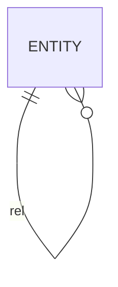

# new

```mermaid
erDiagram
  ENTITY {
  }
  ENTITY ||--|{ ENTITY : rel
  ENTITY ||--o{ ENTITY : rel
%% mermade:{"v":1,"diagramType":"er","nodes":{"ENTITY":{"x":891.33984375,"y":323.5625,"w":220,"h":70,"kind":"entity","members":[]}},"groups":{},"edges":{"e1":{"relation":"oneToMany","label":"rel"},"e2":{"relation":"zeroToMany","label":"rel"}}}
```
