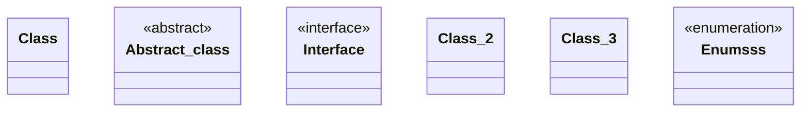

# sssssssddddddddhhsss

```mermaid
classDiagram
  class Class
  class Abstract_class {
    <<abstract>>
  }
  class Interface {
    <<interface>>
  }
  class Class_2
  class Class_3
  class Enumsss {
    <<enumeration>>
  }
%% mermade:{"v":1,"diagramType":"class","nodes":{"Class":{"x":428.65234375,"y":427.6484375,"w":220,"h":70,"kind":"class","members":[]},"Abstract_class":{"x":1255.140625,"y":197.0625,"w":220,"h":70,"kind":"abstract","members":[],"stereotype":"abstract"},"Interface":{"x":672.453125,"y":219.84765625,"w":220,"h":70,"kind":"interface","members":[],"stereotype":"interface"},"Class_2":{"x":689.19921875,"y":514.87109375,"w":220,"h":70,"kind":"class","members":[]},"Class_3":{"x":341.61328125,"y":254.484375,"w":220,"h":70,"kind":"class","members":[]},"Enumsss":{"x":1054.8359375,"y":398.11328125,"w":200,"h":70,"kind":"enum","members":[],"stereotype":"enumeration"}},"groups":{},"edges":{}}
```
