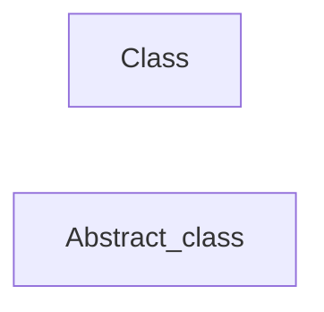

# Untitled

```mermaid
flowchart LR
  Class[Class]
  Abstract_class[Abstract_class]
%% mermade:{"v":1,"diagramType":"architecture","nodes":{"Class":{"x":250,"y":36,"w":200,"h":56,"kind":"service","members":[]},"Abstract_class":{"x":54,"y":36,"w":200,"h":56,"kind":"service","members":[]}},"groups":{},"edges":{}}
```
