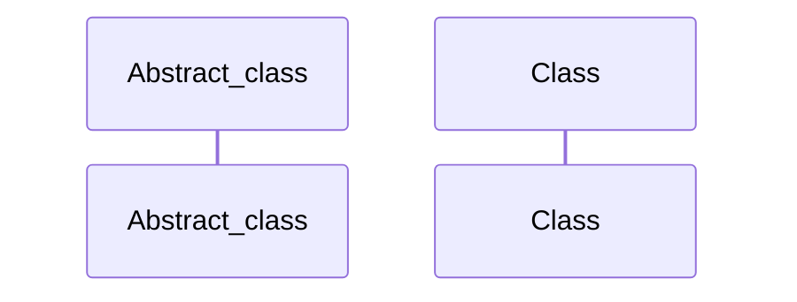

# Untitled

```mermaid
sequenceDiagram
  participant Abstract_class
  participant Class
%% mermade:{"v":1,"diagramType":"sequence","nodes":{"Class":{"x":276,"y":40,"w":148,"h":48,"kind":"participant","members":[]},"Abstract_class":{"x":80,"y":40,"w":148,"h":48,"kind":"participant","members":[]}},"groups":{},"edges":{}}
```
