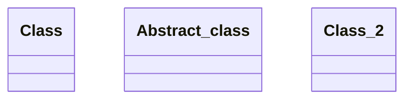

# Untitled

```mermaid
classDiagram
  class Class
  class Abstract_class
  class Class_2
%% mermade:{"v":1,"diagramType":"class","nodes":{"Class":{"x":393.2299107142858,"y":-75.859375,"w":200,"h":56,"kind":"service","members":[]},"Abstract_class":{"x":54,"y":36,"w":200,"h":56,"kind":"service","members":[]},"Class_2":{"x":-43.71149553571432,"y":-165.61216517857142,"w":220,"h":70,"kind":"class","members":[]}},"groups":{},"edges":{}}
```
