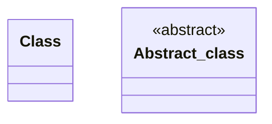

# Untitled

```mermaid
classDiagram
  class Class
  class Abstract_class {
    <<abstract>>
  }
%% mermade:{"v":1,"diagramType":"class","nodes":{"Class":{"x":607.06640625,"y":292.28125,"w":220,"h":70,"kind":"class","members":[]},"Abstract_class":{"x":509.13671875,"y":520.66015625,"w":220,"h":70,"kind":"abstract","members":[],"stereotype":"abstract"}},"groups":{},"edges":{}}
```
