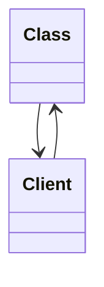

# Untitled

```mermaid
classDiagram
  class Class
  class Client
  Client --> Class
  Class --> Client
%% mermade:{"v":1,"diagramType":"class","nodes":{"Class":{"x":-43.71149553571432,"y":-165.61216517857142,"w":220,"h":70,"kind":"class","members":[]},"Client":{"x":-9.060267857142883,"y":31.292410714285737,"w":140,"h":72,"kind":"client"}},"groups":{},"edges":{"e1":{"relation":"assoc","label":""},"e2":{"relation":"assoc","label":""}}}
```
