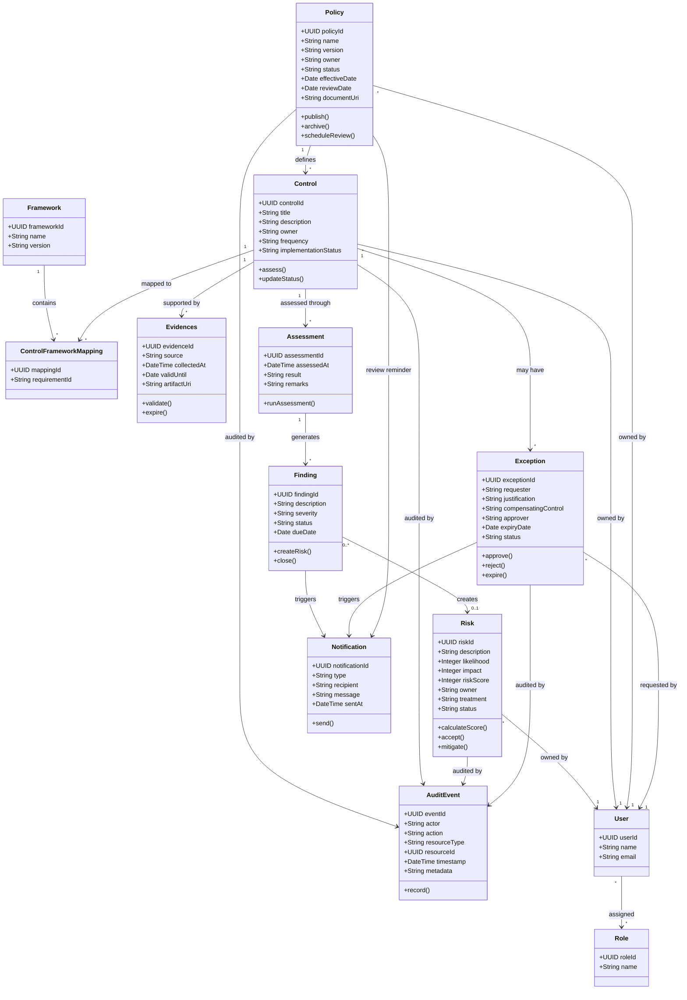

# vul appssss

```mermaid
classDiagram
  class Policy {
    +UUID policyId
    +String name
    +String version
    +String owner
    +String status
    +Date effectiveDate
    +Date reviewDate
    +String documentUri
    +publish()
    +archive()
    +scheduleReview()
  }
  class Control {
    +UUID controlId
    +String title
    +String description
    +String owner
    +String frequency
    +String implementationStatus
    +assess()
    +updateStatus()
  }
  class Framework {
    +UUID frameworkId
    +String name
    +String version
  }
  class ControlFrameworkMapping {
    +UUID mappingId
    +String requirementId
  }
  class Evidences {
    +UUID evidenceId
    +String source
    +DateTime collectedAt
    +Date validUntil
    +String artifactUri
    +validate()
    +expire()
  }
  class Risk {
    +UUID riskId
    +String description
    +Integer likelihood
    +Integer impact
    +Integer riskScore
    +String owner
    +String treatment
    +String status
    +calculateScore()
    +accept()
    +mitigate()
  }
  class Exception {
    +UUID exceptionId
    +String requester
    +String justification
    +String compensatingControl
    +String approver
    +Date expiryDate
    +String status
    +approve()
    +reject()
    +expire()
  }
  class Assessment {
    +UUID assessmentId
    +DateTime assessedAt
    +String result
    +String remarks
    +runAssessment()
  }
  class Finding {
    +UUID findingId
    +String description
    +String severity
    +String status
    +Date dueDate
    +createRisk()
    +close()
  }
  class AuditEvent {
    +UUID eventId
    +String actor
    +String action
    +String resourceType
    +UUID resourceId
    +DateTime timestamp
    +String metadata
    +record()
  }
  class User {
    +UUID userId
    +String name
    +String email
  }
  class Role {
    +UUID roleId
    +String name
  }
  class Notification {
    +UUID notificationId
    +String type
    +String recipient
    +String message
    +DateTime sentAt
    +send()
  }
  Policy "1" --> "*" Control : defines
  Framework "1" --> "*" ControlFrameworkMapping : contains
  Control "1" --> "*" ControlFrameworkMapping : mapped to
  Control "1" --> "*" Evidences : supported by
  Control "1" --> "*" Assessment : assessed through
  Assessment "1" --> "*" Finding : generates
  Finding "0..*" --> "0..1" Risk : creates
  Control "1" --> "*" Exception : may have
  Risk "*" --> "1" User : owned by
  Control "*" --> "1" User : owned by
  Policy "*" --> "1" User : owned by
  Exception "*" --> "1" User : requested by
  User "*" --> "*" Role : assigned
  Policy --> AuditEvent : audited by
  Control --> AuditEvent : audited by
  Risk --> AuditEvent : audited by
  Exception --> AuditEvent : audited by
  Finding --> Notification : triggers
  Exception --> Notification : triggers
  Policy --> Notification : review reminder
%% mermade:{"v":1,"diagramType":"class","nodes":{"Policy":{"x":-193.8708005214481,"y":145,"w":220,"h":260,"kind":"class","members":["+UUID policyId","+String name","+String version","+String owner","+String status","+Date effectiveDate","+Date reviewDate","+String documentUri","+publish()","+archive()","+scheduleReview()"]},"Control":{"x":-59.615920617997794,"y":-336.7170286841816,"w":220,"h":206,"kind":"class","members":["+UUID controlId","+String title","+String description","+String owner","+String frequency","+String implementationStatus","+assess()","+updateStatus()"]},"Framework":{"x":-135.841492248096,"y":652,"w":220,"h":106,"kind":"class","members":["+UUID frameworkId","+String name","+String version"]},"ControlFrameworkMapping":{"x":551.84765625,"y":-424.7170286841816,"w":220,"h":88,"kind":"class","members":["+UUID mappingId","+String requirementId"]},"Evidences":{"x":197.76107158706625,"y":446.5193538894469,"w":220,"h":188,"kind":"class","members":["+UUID evidenceId","+String source","+DateTime collectedAt","+Date validUntil","+String artifactUri","+validate()","+expire()"]},"Risk":{"x":1860,"y":-585.2466592948786,"w":220,"h":260,"kind":"class","members":["+UUID riskId","+String description","+Integer likelihood","+Integer impact","+Integer riskScore","+String owner","+String treatment","+String status","+calculateScore()","+accept()","+mitigate()"]},"Exception":{"x":899.9999999999998,"y":-612.2466592948786,"w":220,"h":242,"kind":"class","members":["+UUID exceptionId","+String requester","+String justification","+String compensatingControl","+String approver","+Date expiryDate","+String status","+approve()","+reject()","+expire()"]},"Assessment":{"x":668.23046875,"y":719.7421875,"w":220,"h":152,"kind":"class","members":["+UUID assessmentId","+DateTime assessedAt","+String result","+String remarks","+runAssessment()"]},"Finding":{"x":1436.9958266230965,"y":-773.2466592948786,"w":220,"h":188,"kind":"class","members":["+UUID findingId","+String description","+String severity","+String status","+Date dueDate","+createRisk()","+close()"]},"AuditEvent":{"x":1527.7822242943928,"y":-325.24665929487855,"w":220,"h":206,"kind":"class","members":["+UUID eventId","+String actor","+String action","+String resourceType","+UUID resourceId","+DateTime timestamp","+String metadata","+record()"]},"User":{"x":1559.62890108098,"y":446.5193538894469,"w":220,"h":106,"kind":"class","members":["+UUID userId","+String name","+String email"]},"Role":{"x":1911.909891426284,"y":317,"w":220,"h":88,"kind":"class","members":["+UUID roleId","+String name"]},"Notification":{"x":856.3205727067326,"y":-25.000000000000007,"w":220,"h":170,"kind":"class","members":["+UUID notificationId","+String type","+String recipient","+String message","+DateTime sentAt","+send()"]}},"groups":{},"edges":{"e1":{"relation":"assoc","label":"defines","fromCard":"1","toCard":"*"},"e2":{"relation":"assoc","label":"contains","fromCard":"1","toCard":"*"},"e3":{"relation":"assoc","label":"mapped to","fromCard":"1","toCard":"*"},"e4":{"relation":"assoc","label":"supported by","fromCard":"1","toCard":"*"},"e5":{"relation":"assoc","label":"assessed through","fromCard":"1","toCard":"*"},"e6":{"relation":"assoc","label":"generates","fromCard":"1","toCard":"*"},"e7":{"relation":"assoc","label":"creates","fromCard":"0..*","toCard":"0..1"},"e8":{"relation":"assoc","label":"may have","fromCard":"1","toCard":"*"},"e9":{"relation":"assoc","label":"owned by","fromCard":"*","toCard":"1"},"e10":{"relation":"assoc","label":"owned by","fromCard":"*","toCard":"1"},"e11":{"relation":"assoc","label":"owned by","fromCard":"*","toCard":"1"},"e12":{"relation":"assoc","label":"requested by","fromCard":"*","toCard":"1"},"e13":{"relation":"assoc","label":"assigned","fromCard":"*","toCard":"*"},"e14":{"relation":"assoc","label":"audited by"},"e15":{"relation":"assoc","label":"audited by"},"e16":{"relation":"assoc","label":"audited by"},"e17":{"relation":"assoc","label":"audited by"},"e18":{"relation":"assoc","label":"triggers"},"e19":{"relation":"assoc","label":"triggers"},"e20":{"relation":"assoc","label":"review reminder"}}}
```
