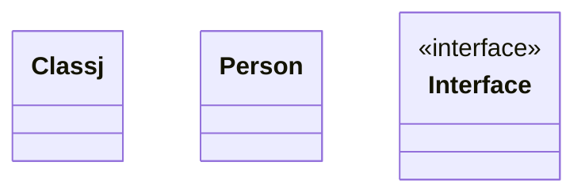

# Untitledj

```mermaid
classDiagram
  class Classj
  class Person
  class Interface {
    <<interface>>
  }
%% mermade:{"v":1,"diagramType":"class","nodes":{"Classj":{"x":552.80078125,"y":335.28125,"w":220,"h":70,"kind":"class","members":[]},"Person":{"x":340,"y":40,"w":120,"h":56,"kind":"actor"},"Interface":{"x":286.04296875,"y":365.01171875,"w":220,"h":70,"kind":"interface","members":[],"stereotype":"interface"}},"groups":{},"edges":{}}
```
