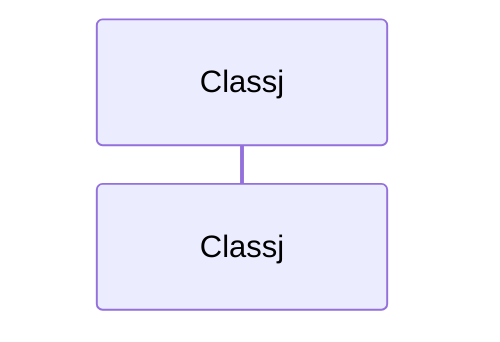

# Untitledj

```mermaid
sequenceDiagram
  participant Classj
%% mermade:{"v":1,"diagramType":"sequence","nodes":{"Classj":{"x":552.80078125,"y":335.28125,"w":220,"h":70,"kind":"class","members":[]}},"groups":{},"edges":{}}
```
