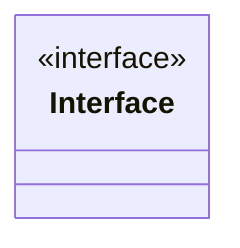

# Untitledkkk

```mermaid
classDiagram
  class Interface {
    <<interface>>
  }
%% mermade:{"v":1,"diagramType":"class","nodes":{"Interface":{"x":644.73046875,"y":411,"w":220,"h":70,"kind":"interface","members":[],"stereotype":"interface"}},"groups":{},"edges":{}}
```
